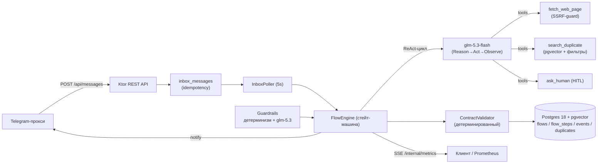

# meetup-flow-agent

Агентский сервис, принимающий сообщения о бесплатных IT-мероприятиях Санкт-Петербурга
из Telegram-группы (через прокси-проект), извлекающий структурированные данные
ReAct-циклом (LLM + инструменты), валидирующий их детерминированным кодом и
складывающий в календарь (Postgres + pgvector) с защитой от дублей, guardrails,
HITL и полным аудитом исполнения.

## Архитектура



**Модели и роутинг** (критерий «разные модели для разных задач»):

| Задача | Модель | Почему |
|---|---|---|
| Guardrails (безопасность входа) | **glm-5.3** | сложные проверки инъекций — сильная модель |
| Агентский цикл (извлечение) | **glm-5.3-flash** | массовые циклы — дешёвая быстрая модель |
| Эмбеддинги (дубль-чек) | **Yandex text-embeddings-v2-doc (768d)** | дешёвые RU-эмбеддинги, pgvector |

**Стейт-машина флоу**: `PROCESSING → {COMPLETED, REJECTED, DUPLICATE, WAITING_HUMAN, WAITING_RETRY}`;
лимит циклов ReAct 8 → +4 при прогрессе (детектор по сигнатуре фактов+тулов) → 16; на капе — ask_human.
Resilience: in-request retry LLM (2×, backoff+jitter), retry-шкала флоу 1m→5m→15m→1h→6h (≤6), CircuitBreaker.

## API (Bearer `APP_TOKEN` на /api)

| Endpoint | Описание |
|---|---|
| `POST /api/messages` | `{idempotencyKey?, text, meta?}` → `202 {flowId}`; повтор ключа → `409 {flowId}` |
| `GET /api/flows/{id}` | флоу + все шаги (включая CoT) + verdict |
| `GET /api/flows/{id}/stream` | SSE: replay по `Last-Event-ID` + live; `waiting_human`/`final`/`heartbeat` |
| `POST /api/flows/{id}/responses` | ответ человека: первый — `202` (резюм), опоздавшие — `409` |
| `GET /api/events?from&to` | календарь событий |
| `GET /internal/metrics` | Prometheus (без токена) |

Исходящие уведомления прокси: `POST {PROXY_BASE_URL}/api/notify` —
`HUMAN_INPUT_REQUIRED | REMINDER | FLOW_COMPLETED | FLOW_FAILED`.

## Инструменты (SOP)

Вызываются только через function calling; результат и любая ошибка возвращаются
агенту как observation (текст + код) — решение «повторить/сменить/спросить»
принимает модель в пределах лимита циклов.

- **`fetch_web_page(url)`** — *когда*: в сообщении есть ссылка, а обязательных
  данных (дата/место/программа/регистрация) не хватает. Один URL за вызов,
  таймаут 15с, тело ≤1MB, редиректов ≤3, SSRF-запрет private/loopback/link-local.
  *Ошибки* (таймаут/4xx/5xx/oversized) → observation с кодом; агент пробует
  другую ссылку или продолжает без данных.
- **`search_duplicate(query, eventDate?, organizer?)`** — *когда*: известны
  название и дата (перед финальным ответом). Эмбеддинг запроса → pgvector top-5
  (косинус) + фильтры (окно ±3 дня, организатор). Пустой результат = «дублей
  нет». Кандидат ≥0.92 — дубль; 0.85–0.92 — серая зона.
- **`ask_human(question, contextSummary, options?)`** — *когда*: данные
  невосстановимы тулами (нет регистрации, сомнение в дубле, кап циклов). Один
  открытый вопрос на флоу; ожидание ≤48ч (REMINDER в 24ч, затем EXPIRED).

## Контракт итогового JSON

`application/main/src/main/resources/schema/event-contract.schema.json`;
детерминированная пост-валидация кодом: обязательны title/startsAt/city;
платное/не-СПб/online-only → REJECTED; нет registrationUrl/endsAt/площадки →
NEEDS_REVIEW; дубль ≥0.92 → DUPLICATE.

## Запуск

```bash
cp .env.example .env            # заполнить: APP_TOKEN, LLM_API_KEY (Z.AI),
                                # EMBEDDING_API_KEY, EMBEDDING_FOLDER_ID, DB_PASSWORD
docker compose up -d postgres   # (+ jaeger/prometheus/grafana — тем же файлом)
./gradlew :application:main:run

# сообщение → 202 → поллер обработает
curl -s -X POST localhost:8090/api/messages -H "Authorization: $APP_TOKEN" \
  -H "Content-Type: application/json" \
  -d @examples/request.json
sleep 20 && curl -s localhost:8090/api/events -H "Authorization: $APP_TOKEN"
curl -s localhost:8090/internal/metrics | grep meetup_
```

UI наблюдаемости: Jaeger `:16686`, Grafana `:3000` (admin/admin, дашборд
provivioned), Prometheus `:9090`.

## Тесты и оценка качества

```bash
./gradlew :application:test:test                 # unit + integration (Testcontainers pg+pgvector, ноль внешних вызовов)
set -a; source .env; set +a                      # реальные ключи:
./gradlew :application:evals:eval                # golden-наборы: guardrails TPR/FPR, extraction-точность; отчёт build/reports/evals/report.md
./gradlew :application:e2e:e2e                   # сквозные сценарии с реальными LLM
```

## Структура

```
application/main    # сервис: agent/ llm/ guardrails/ domain/ flow/ db/ scheduler/ notify/ observability/ route/
application/test    # все unit/integration-тесты (Testcontainers, фейки)
application/evals   # оценка качества на golden set (реальная модель)
application/e2e     # сквозные тесты (реальная модель + реальная БД)
libs/               # starters: config / jackson / logging (+ build-конвенции)
infra/              # prometheus/grafana provisioning
docker-compose.yaml # postgres(pgvector) + jaeger + prometheus + grafana
docs/               # architecture.md, hw2..hw6 — файлы сдачи ДЗ
examples/           # request.json / result.json — пример прогона
```

Домашние задания курса закрыты в ветках `homework1…homework6`; финальная сборка —
ветка `project`.
