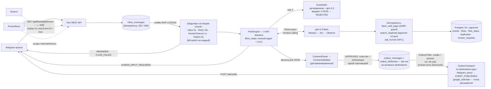

# meetup-flow-agent

Агентский сервис, принимающий сообщения о бесплатных IT-мероприятиях Санкт-Петербурга
из Telegram-группы (через прокси-проект), извлекающий структурированные данные
ReAct-циклом (LLM + инструменты), валидирующий их детерминированным кодом и
складывающий в календарь (Postgres + pgvector) с защитой от дублей, guardrails,
HITL, полным аудитом исполнения и отложенной публикацией проверенных анонсов
(outbox → несколько назначений).

## Архитектура



**Модели и роутинг** (критерий «разные модели для разных задач»):

| Задача | Модель | Почему |
|---|---|---|
| Guardrails (безопасность входа) | **glm-5.3** | сложные проверки инъекций — сильная модель |
| Агентский цикл (извлечение) | **glm-5.3-flash** | массовые циклы — дешёвая быстрая модель |
| Эмбеддинги (дубль-чек) | **Yandex text-embeddings-v2-doc (768d)** | дешёвые RU-эмбеддинги, pgvector |

**Стейт-машина флоу**: `PROCESSING → {COMPLETED, REJECTED, DUPLICATE, WAITING_HUMAN,
WAITING_RETRY, …}` (полная матрица — `flow/FlowStatus.kt`); лимит циклов ReAct 8 → +4
при прогрессе (детектор по сигнатуре фактов+тулов) → 16; на капе — ask_human.
Resilience: in-request retry LLM (2×, backoff+jitter), retry-шкала флоу 1m→5m→15m→1h→6h
(≤6, затем FAILED_PERMANENT), CircuitBreaker; доставки outbox — та же шкала ретраев,
но не трогают статус флоу.

## API (Bearer `APP_TOKEN` на /api)

| Endpoint | Описание |
|---|---|
| `POST /api/messages` | `{idempotencyKey?, text, meta?}` → `202 {flowId}`; повтор ключа → `409 {flowId}` |
| `GET /api/flows/{id}` | флоу + все шаги (включая CoT) + verdict + `deliveries` (outbox) |
| `GET /api/flows/{id}/stream` | SSE: replay по `Last-Event-ID` + live; `waiting_human`/`final`/`heartbeat` |
| `POST /api/flows/{id}/responses` | ответ человека: первый — `202` (резюм), опоздавшие — `409` |
| `GET /api/events?from&to` | календарь событий |
| `GET /internal/outbox?status=&destination=` | инспекция публикаций и доставок (без токена) |
| `GET /internal/metrics` | Prometheus (без токена) |

Служебные уведомления прокси (напрямую, из потока): `POST {PROXY_BASE_URL}/api/notify` —
`HUMAN_INPUT_REQUIRED | REMINDER | FLOW_FAILED`.

## Публикация результата (outbox)

Успешный результат (APPROVED-анонс: офлайн, СПб, бесплатно, не дубль) не отправляется
в потоке обработки — он публикуется отдельным шедулером через **outbox**:

- запись в `outbox_messages` (канонический JSON-снапшот анонса) + fan-out
  `outbox_deliveries` на каждое активное назначение из справочника `destinations`
  — **атомарно в одной транзакции с событием календаря**;
- `OutboxPoller` (5с, kill-switch `SCHEDULER_OUTBOX_ENABLED=false`) клеймит доставки
  (`FOR UPDATE SKIP LOCKED`) и доставляет транспортом по `destinations.type`;
  неудача → ретраи `1m→5m→15m→1h→6h` (≤6), затем `FAILED_PERMANENT` (флоу не трогается);
  зависшие в `SENDING` после краша возвращаются в очередь через 5 минут;
- семантика **at-least-once**: прокси дедуплицирует по `deliveryId`;
- transports — точка расширения: `telegram_proxy` (реализован: `EVENT_PUBLISHED` в
  общий канал через существующий `/api/notify`, готовый текст анонса), гугл-календарь
  и другие — новые имплементации `OutboxTransport`;
- секреты (токены) — в ENV, `destinations.config` хранит только не-секретные параметры;
- наблюдение: блок `deliveries` в `GET /api/flows/{id}`, ручка `GET /internal/outbox`,
  метрики `meetup_outbox_deliveries_total{status,destination}`, `meetup_outbox_depth`.

Добавление канала публикации: `INSERT INTO destinations (id, type, name, config,
is_active) VALUES (gen_random_uuid(), '<type>', '<name>', '{}'::jsonb, true)` —
новые публикации получат доставку в него автоматически (нужна имплементация
транспорта с тем же `type`, иначе доставка завершится `UNSUPPORTED_TRANSPORT`).

## Инструменты (SOP)

Вызываются только через function calling; результат и любая ошибка возвращаются
агенту как observation (текст + код) — решение «повторить/сменить/спросить»
принимает модель в пределах лимита циклов.

- **`fetch_web_page(url)`** — *когда*: в сообщении есть ссылка, а обязательных
  данных (дата/место/программа/регистрация) не хватает. Один URL за вызов,
  таймаут 15с, тело ≤1MB, редиректов ≤3, SSRF-запрет private/loopback/link-local.
  *Ошибки* (таймаут/4xx/5xx/oversized) → observation с кодом; агент пробует
  другую ссылку или продолжает без данных.
- **`search_duplicate(query, eventDate?, organizer?)`** — *когда*: известны
  название и дата (перед финальным ответом). Эмбеддинг запроса → pgvector top-5
  (косинус) + фильтры (окно ±3 дня, организатор). Пустой результат = «дублей
  нет». Кандидат ≥0.92 — дубль; 0.85–0.92 — серая зона.
- **`ask_human(question, contextSummary, options?)`** — *когда*: данные
  невосстановимы тулами (нет регистрации, сомнение в дубле, кап циклов). Один
  открытый вопрос на флоу; ожидание ≤48ч (REMINDER в 24ч, затем EXPIRED).

## Контракт итогового JSON

`application/main/src/main/resources/schema/event-contract.schema.json`;
детерминированная пост-валидация кодом: обязательны title/startsAt/city;
платное/не-СПб/online-only → REJECTED; нет registrationUrl/endsAt/площадки →
NEEDS_REVIEW; дубль ≥0.92 → DUPLICATE.

## Запуск

```bash
cp .env.example .env            # заполнить: APP_TOKEN, LLM_API_KEY (Z.AI),
                                # EMBEDDING_API_KEY, EMBEDDING_FOLDER_ID, DB_PASSWORD,
                                # PROXY_BASE_URL/PROXY_TOKEN (куда доставлять публикации)
docker compose up -d postgres   # (+ jaeger/prometheus/grafana — тем же файлом)
./gradlew :application:main:run

# сообщение → 202 → поллер обработает
curl -s -X POST localhost:8090/api/messages -H "Authorization: $APP_TOKEN" \
  -H "Content-Type: application/json" \
  -d @examples/request.json
sleep 20 && curl -s localhost:8090/api/events -H "Authorization: $APP_TOKEN"
curl -s localhost:8090/internal/metrics | grep meetup_
```

UI наблюдаемости: Jaeger `:16686`, Grafana `:3000` (admin/admin, дашборд
provisioned), Prometheus `:9090`.

## Telegram-прокси (Railway)

`telegram-proxy/` — отдельный composite build (Ktor :8082, long polling через
telegrambots), стоит **на Railway**, а не рядом с агентом. Оба направления:

- **Вход**: апдейт Telegram → прокси НЕ разбирает содержимое, сериализует всю
  DTO `Update` в JSON → `POST /api/messages` с `idempotencyKey = "tg-<updateId>"`
  (дубли глушатся 409); обработку сырого JSON делает агент. Флоу создают только
  сообщения из заданной группы и топика (`TELEGRAM_SOURCE_CHAT_ID` +
  `TELEGRAM_SOURCE_TOPIC_ID`, message_thread_id; пустые значения — фильтр
  выключен, сообщения из прочих чатов игнорируются);
- **Выход**: `POST /api/notify` → Bot API; HITL-вопрос приходит кнопками
  (клик/reply на вопрос → `POST /api/flows/{id}/responses`, первый ответ
  побеждает), первый ответ снимает кнопки у всех адресатов.

Адресация уведомлений агента:

| Событие | Кому |
|---|---|
| `HUMAN_INPUT_REQUIRED` | активные `users` (личные чаты, кнопки) |
| `REMINDER`, `FLOW_FAILED` | активные `users`; пусто → общий канал |
| `EVENT_PUBLISHED` | общий канал `TELEGRAM_MAIN_CHAT_ID` |

Список адресатов — таблица `users`, наполняется вручную:

```sql
INSERT INTO users (id, telegram_user_id, display_name, role)
VALUES (gen_random_uuid(), <tg_user_id>, '<Имя>', 'member');
```

**Kill-switch бота**: `TELEGRAM_BOT_ENABLED` по умолчанию `false` — тесты и
локальный запуск (`./gradlew :telegram-proxy:main:run`) поднимают только
Ktor-сервер, без long polling и вызовов Bot API; на Railway включается явно
(пустой токен при включённом флаге — fail-fast на старте).

Деплой: `./telegram-proxy/deploy-railway.sh` собирает fatJar, кладёт в
wrapper-репо `railway-meetup-tg-proxy` и пушит — Railway пересобирает контейнер
(long polling ⇒ один инстанс). Связка с агентом — env `PROXY_BASE_URL` /
`PROXY_TOKEN` (общий секрет с `PROXY_TOKEN` прокси), полный список ENV —
`telegram-proxy/.env.example`.

## Тесты и оценка качества

```bash
./gradlew :application:test:test                 # unit + integration (Testcontainers pg+pgvector, ноль внешних вызовов)
./gradlew :telegram-proxy:main:test              # тесты прокси (бот выключен kill-switch'ом)
set -a; source .env; set +a                      # реальные ключи:
./gradlew :application:evals:eval                # golden-наборы: guardrails TPR/FPR, extraction-точность; отчёт build/reports/evals/report.md
./gradlew :application:e2e:e2e                   # сквозные сценарии с реальными LLM
```

## Структура

```
application/main    # сервис: agent/ llm/ guardrails/ domain/ flow/ db/ scheduler/ notify/ outbox/ observability/ route/
application/test    # все unit/integration-тесты (Testcontainers, фейки)
application/evals   # оценка качества на golden set (реальная модель)
application/e2e     # сквозные тесты (реальная модель + реальная БД)
telegram-proxy/     # Telegram-прокси на Railway: long polling ↔ REST агента (отд. wrapper-репо)
libs/               # starters: config / jackson / logging (+ build-конвенции)
infra/              # prometheus/grafana provisioning
docker-compose.yaml # postgres(pgvector) + jaeger + prometheus + grafana
docs/               # architecture.md, hw2..hw6 — файлы сдачи ДЗ
examples/           # request.json / result.json — пример прогона
```

Домашние задания курса закрыты в ветках `homework1…homework6`; финальная сборка —
ветка `project`.
