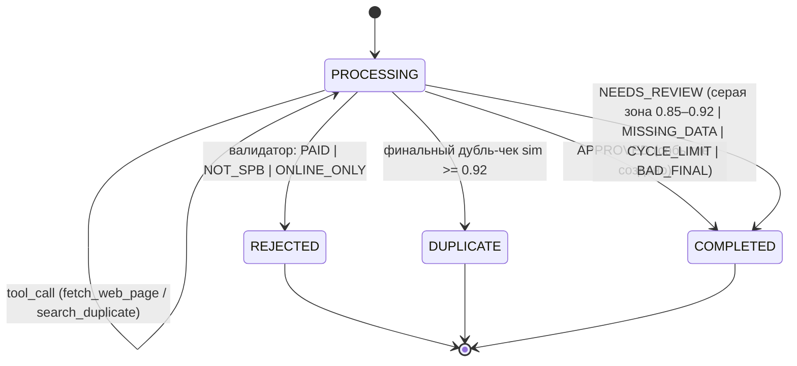

# ДЗ5 — Логика выполнения агента

## Схема логики (стейт-машина флоу)



Матрица переходов зафиксирована кодом (`FlowTransitions`) и покрыта тестом:
недопустимая пара (например, COMPLETED → PROCESSING) кидает
`IllegalFlowTransitionException`.

## Управляемый сценарий из 5 шагов

`AgentFlowService.run(message)` — оркестратор (стейт-машина + БД):

1. **Извлечение** — цикл Reason → Act → Observe с тулами
   (`fetch_web_page`, `search_duplicate`); вся история сессии в
   `ConversationState`, каждый шаг пишется в `flow_steps` (REASON с CoT,
   ACTION, OBSERVATION) + `state_snapshot` (snapshotVersion=1).
2. **fetch_web_page** — если данных мало и есть ссылка (решение модели, SOP).
3. **search_duplicate** — когда известны название и дата (решение модели, SOP):
   смысловой поиск + фильтры даты/организатора — память ДЗ4.
4. **Финальный JSON** — модель завершает цикл; строгий `ContractParser`
   (markdown-обёртки/проза → `ContractParseException`).
5. **Пост-валидация + вердикт + статус** — детерминированный
   `ContractValidator` (§7: код, не модель) + финальный дубль-чек перед записью:
   - PAID / NOT_SPB / ONLINE_ONLY → **REJECTED** (жёсткие правила отбора);
   - нет title/startsAt/city или registrationUrl/endsAt/venue →
     **COMPLETED + NEEDS_REVIEW [MISSING_DATA]** (событие не создаётся);
   - дубль ≥ 0.92 → **DUPLICATE** + связь в `duplicates(existing_event_id,
     similarity, decided_by=AGENT)`;
   - серая зона 0.85–0.92 → **COMPLETED + NEEDS_REVIEW [POSSIBLE_DUPLICATE]**;
   - иначе APPROVED → **COMPLETED** + insert в `events` (с эмбеддингом);
   - 10 итераций без финала → **COMPLETED + NEEDS_REVIEW [CYCLE_LIMIT]**;
     финал вне контракта → **COMPLETED + NEEDS_REVIEW [BAD_FINAL]** + ERROR-шаг.

## API

- `POST /api/messages` `{text}` → `200 {flowId, status, verdict{status,reasons},
  eventId?, duplicateOf?, similarity?, reply, toolCalls, iterations, limitReached}`
  (синхронно; с `Accept: text/event-stream` — SSE тех же событий, `final`
  несёт тот же итог);
- `GET /api/flows/{id}` → флоу + все шаги по seq (включая CoT) + verdict;
  404/400.

## Пример выполнения

**1) Happy path** — сообщение о новом митапе:

```
POST /api/messages {"text":"Митап SPb Go Community #20: четверг 15 октября 2026,
 19:00, «Кронверк» (Съезжинская 26, СПб). Бесплатно, регистрация
 https://gospb.timepad.ru. Доклады: «Generics в Go», «Распределённые трейсеры»."}

→ {"flowId":"c262…","status":"COMPLETED","verdict":{"status":"APPROVED","reasons":[]},
   "eventId":"7510…","iterations":2,
   "toolCalls":[{"name":"search_duplicate","ok":true}]}
```

`GET /api/flows/{id}` — пять шагов управляемого сценария:

```
seq=1 REASON       :: CoT: "The message contains: Event: SPb Go Community #20, Date…"
seq=2 ACTION       :: search_duplicate (query, eventDate=2026-10-15, organizer)
seq=3 OBSERVATION  :: ok=true — «кандидатов не найдено»
seq=4 REASON       :: CoT: "No duplicates found. All data present: SPb, free, offline…"
seq=5 FINAL        :: {"title":"SPb Go Community #20", …} → APPROVED, событие создано
```

**2) Ветвление REJECTED** — платная конференция:

```
POST {"text":"Big Data Moscow — СПб день: 5 ноября, от 4500 рублей, Экспофорум…"}
→ {"status":"REJECTED","verdict":{"status":"REJECTED","reasons":["PAID"]}}
```

**3) Ветвление DUPLICATE** — повторное сообщение ДРУГИМИ словами:

```
POST {"text":"Не забываем: 15 октября вечером (19:00), на Съезжинской 26 в
 «Кронверке» — двадцатая встреча питерских гоферов SPb Go Community…"}

→ {"status":"DUPLICATE","verdict":{"status":"NEEDS_REVIEW","reasons":["MISSING_DATA"]},
   "duplicateOf":"7510…","similarity":0.9361}
```

Проверка оркестратора по полному представлению дала
0.936 ≥ 0.92 → флоу переведён в DUPLICATE, связь записана:

```
SELECT flow_id, existing_event_id, similarity, decided_by FROM duplicates;
 36aad43b… | SPb Go Community #20 | 0.936 | AGENT
```

## Как воспроизвести

```bash
cp .env.example .env   # APP_TOKEN, LLM_API_KEY, EMBEDDING_*, DB_PASSWORD
docker compose up -d postgres
./gradlew :application:main:run
curl -s -X POST localhost:8090/api/messages -H "Authorization: $APP_TOKEN" \
  -H "Content-Type: application/json" -d '{"text":"…сообщение о митапе…"}'
curl -s localhost:8090/api/flows/<flowId> -H "Authorization: $APP_TOKEN"
```

## Тесты

- `FlowTransitionTest` — матрица переходов: допустимые проходят, терминальные
  статусы финальны, WAITING-переходов пока нет.
- `ContractParserTest` — чистый/markdown-обёрнутый JSON, мусор, битые скобки,
  массив вместо объекта, unknown-поля игнорируются.
- `ContractValidatorTest` — таблица решений: happy; PAID; NOT_SPB; синоним СПб;
  ONLINE_ONLY; MISSING_DATA (нет регистрации); обязательные поля;
  REJECTED побеждает NEEDS_REVIEW.
- `AgentFlowServiceIT` (Testcontainers + FakeChatClient) — happy (COMPLETED +
  событие с эмбеддингом + шаги REASON/ACTION/OBSERVATION/FINAL + snapshot);
  платное → REJECTED; дубль ≥0.92 → DUPLICATE + строка в duplicates; серая
  зона → COMPLETED/NEEDS_REVIEW/POSSIBLE_DUPLICATE без события; хард-кап →
  CYCLE_LIMIT; битый финал → BAD_FINAL + ERROR-шаг.
- `FlowRouteTest` — POST (тело ответа, 401 без токена), SSE-стрим с final-итогом,
  GET /api/flows/{id} (шаги по seq, CoT доступен), 404, 400.

`./gradlew :application:test:test` — зелёный.
